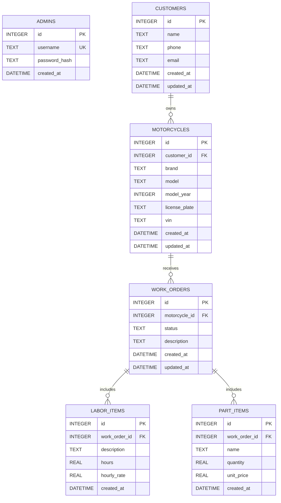

# Adatbázis és ER-diagram

Az alkalmazás SQLite-adatbázisa a `backend/database/motohub.db` fájl. Az adatbázis sémáját a `backend/database/init.js` hozza létre.

## ER-diagram



Az `admins` tábla önálló bejelentkezési fiókokat tárol. A `password_hash` bcrypt hash; nyers jelszó nem kerül az adatbázisba.

## Kapcsolatok és üzleti szabályok

- Egy ügyfélhez több motorkerékpár tartozhat; egy motorkerékpár egy ügyfélhez tartozik.
- Egy motorkerékpárhoz több munkalap készülhet; egy munkalap egy motorkerékpárhoz tartozik.
- Egy munkalaphoz több munkadíj- és alkatrésztétel rögzíthető.
- A munkadíjtételek és alkatrésztételek törlődnek, ha a hozzájuk tartozó munkalap törlődik (`ON DELETE CASCADE`).
- A munkalap státuszának megengedett értékei: `OPEN`, `IN_PROGRESS`, `WAITING_PARTS`, `READY_FOR_PICKUP`, `COMPLETED`.
- A munkalap végösszege számított érték: a `hours × hourly_rate` munkadíjak és a `quantity × unit_price` alkatrészek összege. A végösszeg nincs külön eltárolva.

## Séma létrehozása és adatbázisfájl

Backend könyvtárból futtasd:

```powershell
npm run db:init
```

Ez a séma nélküli adatbázist előkészíti, de meglévő adatokat nem töröl. A tesztadatokat betöltő `npm run seed` parancs törli a munkalaphoz kapcsolódó ügyfél-, motor- és tételadatokat is, ezért csak eldobható tesztadatbázison futtasd.

Az ER-diagram sémaforrása a `backend/database/init.js`; a diagram leírása Mermaid formátumú, ezért Mermaid-kompatibilis Markdown-megjelenítőben vizuálisan is kirajzolható.
